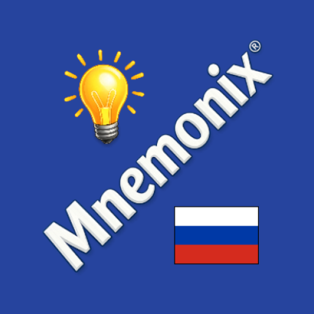
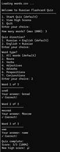

# Russian Flashcards Console App
> This app is designed for learners already familiar with the Russian alphabet and Cyrillic script.

(Initial public release)  
This app uses a flashcard learning technique to help you master the <b>1,000 most common Russian words</b> sourced from the <i>Russian Research Institute of Artificial Intelligence</i>.
 
## Contents
The package consists of a zip file (_Russian-Flashcards-Java-Project-v<...>.zip_) with the following contents:

- JAR file
- _words.csv_ file
- _run-windows.bat_ batch file
- _run-linux-and-mac.sh_ batch file

(The zip file can be found in the Releases section on the right.)

## Installing / Getting started
> 
> 
> This app requires Java 17 or later

Extract all files to one folder and run the launcher appropriate to your operating system.  

Note that the app will create an additional file (_Highscores.txt_) in the same folder at run time.

For typing Russian you will need to install a Russian keyboard layout if you do not already have one. Alternatively, you can copy text from a virtual Russian keyboard app.
> <b>Tip for Windows users</b>   
> Install the "Russian for Gringos" keyboard layout: http://shininghappypeople.net/deljr/gringos/vista/index.htm

## Features
Start each session by specifying the following:
- Number of words
- Quiz direction (Show Russian words or English words?)
- Word type (all, noun, verb etc.)  

Complete the quiz, typing your answers in the console.

At the end of the quiz, you wil be shown your score.

The top 10 high scores can be seen anytime with the appropriate selection in the startup menu.

## Example session

## Expanding the functionality

Word information is stored in the <i>words.csv</i> file.  
You can use a text editor to edit or delete entries in the file as needed, or add your own entries.